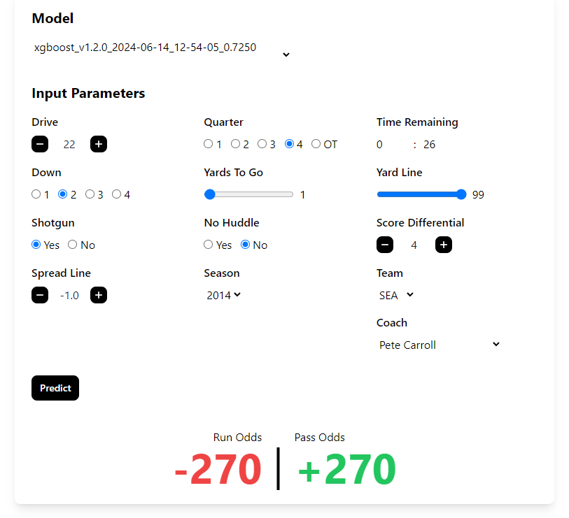

# Play Prediction

[](https://predict.hansmissenhe.im)

**Play Prediction** is a machine learning model trained to predict future NFL plays with user-friendly dashboard providing betting analysis. This XGBoost model achieves performance comparable to the top published research, while maintaining simple ease-of-use to allow users to make predictions within the 40 second play clock!

## Inspiration

This project continues the work from my [Data Science Capstone](https://github.com/hansmissenheim/dat490-capstone), where I investigated machine learning models for predicting NFL plays. While I was able to create a similar performing model using a custom feedforward neural network, the inference time and hardware requirements limited its practicality beyond the initial use case of NFL teams predicting their opponents' plays.

After attending Bojan Tunguz's talk at GTC, ***[XGBoost is All You Need](https://www.nvidia.com/en-us/on-demand/session/gtc24-s62960)***, I was motivated to revisit this task using the `xgboost` python library. This approach allows the model to be hosted on a limited-resource machine while still providing near-instant predictions. While this can assist NFL staffs in preparing for the next play, the user-friendly dashboard enables anyone to make a more accurate guess of what they'll see next while watching the game. Additionally sportsbooks have begun offering wagers on the next play, this model can compute betting odds based on its predictions, adding further utility.

## Try it now!

The prediction dashboard with the latest model can be used at [predict.hansmissenhe.im](https://predict.hansmissenhe.im)!

## Run it locally

In order to run the project locally, [Docker](https://docs.docker.com/get-docker/) needs to be installed on your machine. After installation, simply run:

```bash
docker pull hansmissenheim/play-prediction:latest
docker run -p 8000:80 hansmissenheim/play-prediction:latest
```

After that, you should be able to access the prediction dashboard at [localhost:8000](http://localhost:8000).

## Contributing

### Clone the repo

```bash
git clone https://github.com/hansmissenheim/play-prediction@latest
cd play-prediction
```

### Install [Poetry](https://github.com/python-poetry/poetry) if not installed
```bash
curl -sSL https://install.python-poetry.org
```

### Install dependencies
```bash
poetry install
poetry shell
```

### And run the application
```bash
flask --app app/app.py --debug run
```

### Submit a pull request

If you would like to contribute to the project, create a fork and open a pull request on the `main` branch.
